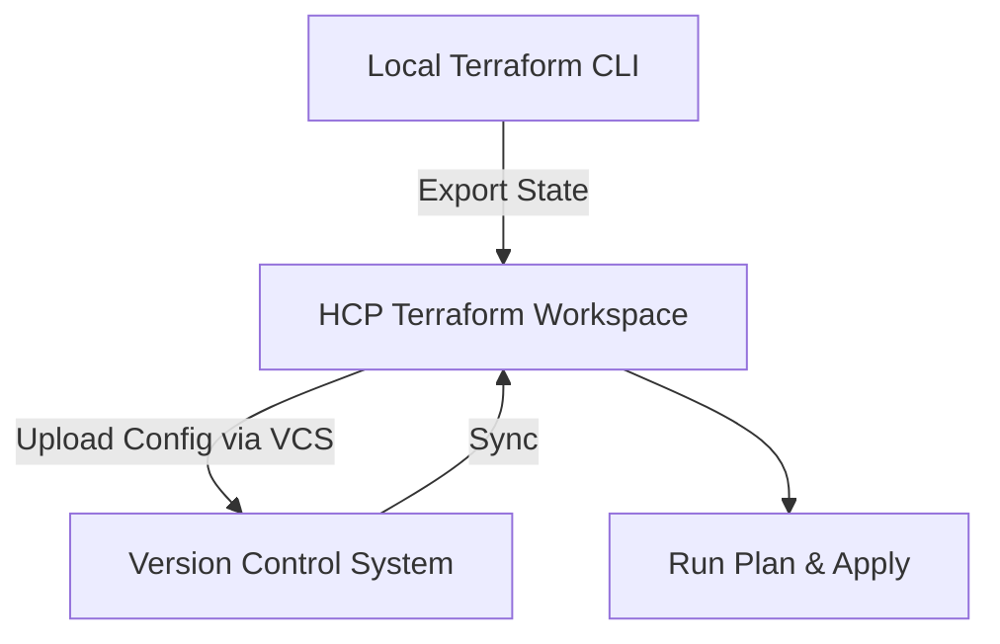

# Migrating from Terraform Community to HCP Terraform

## Overview
Migrating from Terraform Community (CLI-based) to HCP Terraform enables remote state management, collaboration, and policy enforcement. This guide includes:
- Steps to migrate state and configuration
- Correct version behavior during migration
- Controlled upgrade steps

---

## Steps to Migrate State and Configuration

1. **Prepare Your Environment**
   - Ensure you have access to HCP Terraform and an organization set up.
   - Verify your local Terraform configuration and state files.

2. **Create a Workspace in HCP Terraform**
   - Navigate to your HCP Terraform organization.
   - Create a new workspace.
   - During creation, select the desired Terraform version (defaults to latest supported).

3. **Update Backend Configuration**
   - Modify your `main.tf` to use the HCP Terraform remote backend:
     ```hcl
     terraform {
       cloud {
         organization = "<org>"
         workspaces {
           name = "<workspace>"
         }
       }
     }
     ```

4. **Reinitialize and Migrate State**
   - In your local environment, run:
     ```bash
     terraform login
     terraform init
     ```
   - Terraform will prompt you to migrate your local state to the remote backend during `init`. Confirm the migration.

5. **Connect Configuration**
   - Push your configuration to a VCS (e.g., GitHub, GitLab) and link it to the workspace.
   - Alternatively, upload configuration files directly.

6. **Validate and Apply**
   - Run a plan in HCP Terraform to ensure everything is correct.
   - Apply changes if needed.

---

## Correct Version Behavior During Migration

From [HashiCorp Docs](https://developer.hashicorp.com/terraform/tutorials/cloud/cloud-versions):

- **New Workspace Creation**: Defaults to the most recent Terraform version supported by HCP Terraform.
- **Migration from CLI**: If you migrate an existing project, HCP Terraform detects the Terraform binary version you used during migration and configures the workspace to match that version.
- **Version Control**: You can change the version in the workspace settings page to control how and when your projects use newer versions of Terraform.

HCP Terraform also provides the ability to upgrade your Terraform version in a controlled manner, ensuring safe and predictable upgrades without impacting existing infrastructure or state.

---

## Controlled Upgrade Steps

1. Navigate to your workspace settings in HCP Terraform.
2. Select the desired Terraform version from the dropdown.
3. Review the upgrade notes and provider compatibility.
4. Run a speculative plan to validate changes.
5. Apply changes only after successful validation.

**Tip:** Always test upgrades in a staging workspace before applying to production.

---

## Tips & Tricks
- Always pin your Terraform version in configuration using `required_version`.
- Use version constraints to avoid accidental upgrades.
- Validate state integrity after migration.

---

## Quick MCQs

**Q1:** What version does a new HCP Terraform workspace use by default?
- A) The version from your local CLI
- B) The latest supported version in HCP Terraform
- C) The oldest version available

**Answer:** B

**Q2:** When migrating from CLI, what version does HCP Terraform configure?
- A) Latest version
- B) Same as your local Terraform binary
- C) Random version

**Answer:** B

**Q3:** Can you upgrade Terraform version in HCP Terraform safely?
- A) No
- B) Yes, via controlled upgrade in workspace settings

**Answer:** B

---

## Migration Workflow Diagram


