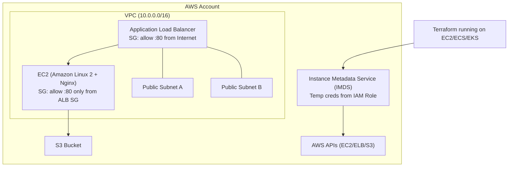

# Terraform Provider Authentication (AWS, Azure, GCP & New Providers)

## 1. Why Authentication is Required
Every Terraform provider requires authentication to access its respective platform. Terraform itself does not manage credentials; authentication is handled by each provider.

---

# 2. Authentication Methods (Worst → Best)

## ❌ 1. Hard‑coding credentials in Terraform files (Never Do This)
```hcl
provider "aws" {
  access_key = "AKIA..."
  secret_key = "my-secret"
}
```
**Problems:** insecure, leaked in Git, stored in state file.

---

## ⚠ 2. Environment Variables
Good for local dev, not great for production.

### AWS
```bash
export AWS_ACCESS_KEY_ID="..."
export AWS_SECRET_ACCESS_KEY="..."
```
### Azure
```bash
export ARM_CLIENT_ID="..."
export ARM_CLIENT_SECRET="..."
```
### GCP
```bash
export GOOGLE_APPLICATION_CREDENTIALS="/path/key.json"
```

---

## 👍 3. Cloud CLI Authentication
### AWS
```
aws configure
```
### Azure
```
az login
```
### GCP
```
gcloud auth application-default login
```
Terraform automatically picks these credentials.

---

## 🥇 4. Cloud-Native Identity (Best Practice)
- AWS → IAM Role attached to EC2/ECS/Lambda
- Azure → Managed Identity
- GCP → Service Account attached to VM/GKE

No secrets → highly secure.
---
### 4.1 Cloud‑Native Identity Assumptions (AWS, Azure, GCP)

#### 🟩 AWS – IAM Role via IMDS
- Terraform runs inside **AWS** (EC2/ECS/EKS).
- An **IAM role** is attached to the compute resource.
- The role has permissions for EC2, ELBv2, VPC, S3, etc.
- No `access_key` or `secret_key` stored.
- Terraform auto-loads temporary STS credentials from IMDS:
  `http://169.254.169.254/latest/meta-data/iam/security-credentials/`

#### 🟦 Azure – Managed Identity (System/User Assigned)
- Terraform runs inside **Azure** (VM/AKS/ACI/AppService).
- A **Managed Identity** is enabled and attached.
- Identity has RBAC permissions (Contributor/Network Contributor/etc.).
- No client secrets or passwords needed.
- Terraform retrieves tokens via MSI endpoint:
  `http://169.254.169.254/metadata/identity/oauth2/token`

#### 🟧 GCP – Attached Service Account Metadata
- Terraform runs on **GCP** (GCE/GKE/CloudRun/Functions).
- A **Service Account** is attached to the compute resource.
- Service account has roles like Compute Admin / Storage Admin.
- No JSON credential file used.
- Terraform loads OAuth tokens from GCP Metadata Server:
  `http://metadata.google.internal/computeMetadata/v1/`

---


## 🏆 5. Secret Managers / Vault
Use:
- HashiCorp Vault
- AWS Secrets Manager
- Azure Key Vault
- GCP Secret Manager

CI pipelines fetch short-lived tokens.

---

## ⭐ 6. HCP Terraform with OIDC (Best for Teams)
- Store credentials in sensitive, write-only variables
- Use OIDC between GitHub → Cloud → Provider

---

# 3. Multi-Cloud Example (AWS + Azure + GCP)
```hcl
terraform {
  required_providers {
    aws     = { source = "hashicorp/aws", version = "~> 5.0" }
    azurerm = { source = "hashicorp/azurerm", version = "~> 4.0" }
    google  = { source = "hashicorp/google", version = "~> 6.0" }
  }
}

provider "aws" {
  region = "us-east-1"
}

provider "azurerm" {
  features {}
}

provider "google" {
  project = "my-gcp-project"
  region  = "us-central1"
}
```

---

# 4. How to Discover Authentication for Any New Provider

## Step 1 → Go to Terraform Registry
https://registry.terraform.io

Search for the provider name: e.g., `vsphere`.

## Step 2 → Open the Provider Page
Look for section:
- **Authentication**
- **Provider Configuration**
- **Environment Variables**

## Step 3 → Identify Resource Prefix
Example:
- `aws_instance` → AWS
- `azurerm_virtual_network` → Azure
- `google_compute_instance` → GCP
- `vsphere_virtual_machine` → VMware

Prefix tells you which provider it belongs to.

---

# 5. Summary Table
| Rank | Method | Security | Recommendation |
|------|---------|----------|----------------|
| ❌ 1 | Hard-coded secrets | 🚫 Worst | Never use |
| ⚠ 2 | Environment variables | ⚠ Medium | Dev only |
| 👍 3 | CLI login | 👍 Good | Local use |
| 🥇 4 | IAM Role / Managed Identity | 🥇 Excellent | Production |
| 🏆 5 | Secret Manager / Vault | 🏆 Best | CI/CD |
| ⭐ 6 | HCP Terraform + OIDC | ⭐ Enterprise | Teams |

---

# 6. Perfect for Terraform Associate 004 Exam
- Providers always need authentication
- Never store secrets in `.tf` files
- Prefer IAM roles / Managed Identity / Service Accounts
- Use Terraform Registry to explore new providers

---

# 7. Cloud‑Native Identity Example: **AWS EC2 + ALB + S3** (No Keys in Code)

> **Assumption:** Terraform runs on **EC2/ECS/EKS** with an **IAM role attached** that has permissions for EC2/VPC/ELBv2/S3. The AWS provider will automatically use temporary credentials from the **Instance Metadata Service (IMDS)**. No `access_key`/`secret_key` are stored in code or state.

```hcl
terraform {
  required_version = ">= 1.6.0"
  required_providers {
    aws = {
      source  = "hashicorp/aws"
      version = "~> 5.0"
    }
  }
}

# Cloud-native identity: credentials are provided by the instance role via IMDS.
provider "aws" {
  region = var.region
}

########################
# Variables & Locals
########################
variable "region" {
  type    = string
  default = "us-east-1"
}

variable "name_prefix" {
  type    = string
  default = "cloud-native-demo"
}

locals {
  name = var.name_prefix
  tags = {
    Project = local.name
    Owner   = "platform"
  }
}

########################
# Networking (VPC + 2x public subnets + IGW + route)
########################
resource "aws_vpc" "this" {
  cidr_block           = "10.0.0.0/16"
  enable_dns_hostnames = true
  enable_dns_support   = true
  tags = merge(local.tags, { Name = "${local.name}-vpc" })
}

resource "aws_internet_gateway" "this" {
  vpc_id = aws_vpc.this.id
  tags   = merge(local.tags, { Name = "${local.name}-igw" })
}

resource "aws_subnet" "public_a" {
  vpc_id                  = aws_vpc.this.id
  cidr_block              = "10.0.1.0/24"
  availability_zone       = "${var.region}a"
  map_public_ip_on_launch = true
  tags = merge(local.tags, { Name = "${local.name}-public-a" })
}

resource "aws_subnet" "public_b" {
  vpc_id                  = aws_vpc.this.id
  cidr_block              = "10.0.2.0/24"
  availability_zone       = "${var.region}b"
  map_public_ip_on_launch = true
  tags = merge(local.tags, { Name = "${local.name}-public-b" })
}

resource "aws_route_table" "public" {
  vpc_id = aws_vpc.this.id
  tags   = merge(local.tags, { Name = "${local.name}-rt-public" })
}

resource "aws_route" "internet" {
  route_table_id         = aws_route_table.public.id
  destination_cidr_block = "0.0.0.0/0"
  gateway_id             = aws_internet_gateway.this.id
}

resource "aws_route_table_association" "public_a" {
  subnet_id      = aws_subnet.public_a.id
  route_table_id = aws_route_table.public.id
}

resource "aws_route_table_association" "public_b" {
  subnet_id      = aws_subnet.public_b.id
  route_table_id = aws_route_table.public.id
}

########################
# Security Groups
########################
resource "aws_security_group" "alb_sg" {
  name        = "${local.name}-alb-sg"
  description = "Allow HTTP to ALB"
  vpc_id      = aws_vpc.this.id

  ingress {
    description = "HTTP from anywhere"
    from_port   = 80
    to_port     = 80
    protocol    = "tcp"
    cidr_blocks = ["0.0.0.0/0"]
  }

  egress {
    description = "All egress"
    from_port   = 0
    to_port     = 0
    protocol    = "-1"
    cidr_blocks = ["0.0.0.0/0"]
  }

  tags = merge(local.tags, { Name = "${local.name}-alb-sg" })
}

resource "aws_security_group" "ec2_sg" {
  name        = "${local.name}-ec2-sg"
  description = "Allow HTTP from ALB security group"
  vpc_id      = aws_vpc.this.id

  ingress {
    description     = "HTTP from ALB SG"
    from_port       = 80
    to_port         = 80
    protocol        = "tcp"
    security_groups = [aws_security_group.alb_sg.id]
  }

  egress {
    description = "All egress"
    from_port   = 0
    to_port     = 0
    protocol    = "-1"
    cidr_blocks = ["0.0.0.0/0"]
  }

  tags = merge(local.tags, { Name = "${local.name}-ec2-sg" })
}

########################
# AMI lookup (Amazon Linux 2)
########################
data "aws_ami" "al2" {
  most_recent = true
  owners      = ["amazon"]

  filter {
    name   = "name"
    values = ["amzn2-ami-hvm-*-x86_64-gp2"]
  }

  filter {
    name   = "virtualization-type"
    values = ["hvm"]
  }
}

########################
# EC2 instance (Nginx)
########################
resource "aws_instance" "web" {
  ami                         = data.aws_ami.al2.id
  instance_type               = "t3.micro"
  subnet_id                   = aws_subnet.public_a.id
  vpc_security_group_ids      = [aws_security_group.ec2_sg.id]
  associate_public_ip_address = true

  user_data = <<-EOF
              #!/bin/bash
              yum update -y
              amazon-linux-extras install nginx1 -y || yum install -y nginx
              echo "<h1>${local.name} - Hello from EC2 behind ALB</h1>" > /usr/share/nginx/html/index.html
              systemctl enable nginx
              systemctl start nginx
              EOF

  tags = merge(local.tags, { Name = "${local.name}-web" })
}

########################
# ALB + Target Group + Listener
########################
resource "aws_lb" "app" {
  name               = "${local.name}-alb"
  internal           = false
  load_balancer_type = "application"
  security_groups    = [aws_security_group.alb_sg.id]
  subnets            = [aws_subnet.public_a.id, aws_subnet.public_b.id]

  tags = merge(local.tags, { Name = "${local.name}-alb" })
}

resource "aws_lb_target_group" "tg" {
  name        = "${local.name}-tg"
  port        = 80
  protocol    = "HTTP"
  vpc_id      = aws_vpc.this.id
  target_type = "instance"

  health_check {
    protocol = "HTTP"
    path     = "/"
    port     = "traffic-port"
    matcher  = "200"
  }

  tags = merge(local.tags, { Name = "${local.name}-tg" })
}

resource "aws_lb_target_group_attachment" "web" {
  target_group_arn = aws_lb_target_group.tg.arn
  target_id        = aws_instance.web.id
  port             = 80
}

resource "aws_lb_listener" "http" {
  load_balancer_arn = aws_lb.app.arn
  port              = 80
  protocol          = "HTTP"

  default_action {
    type             = "forward"
    target_group_arn = aws_lb_target_group.tg.arn
  }
}

########################
# S3 (globally unique name)
########################
resource "random_id" "bucket_suffix" {
  byte_length = 4
}

resource "aws_s3_bucket" "bucket" {
  bucket        = "${local.name}-${random_id.bucket_suffix.hex}"
  force_destroy = true
  tags          = merge(local.tags, { Name = "${local.name}-s3" })
}

########################
# Outputs
########################
output "alb_dns_name" {
  description = "Public DNS of the ALB"
  value       = aws_lb.app.dns_name
}

output "ec2_public_ip" {
  description = "EC2 public IP"
  value       = aws_instance.web.public_ip
}

output "s3_bucket_name" {
  description = "S3 bucket name"
  value       = aws_s3_bucket.bucket.bucket
}
```

> **Run:**
> 1) Attach an IAM role to the instance that runs Terraform (EC2/ECS/EKS).> 2) `terraform init && terraform apply`> 3) Open the `alb_dns_name` output in a browser.

---

## 8. Mermaid Architecture (ALB + EC2 + S3 + Cloud‑Native Identity)



