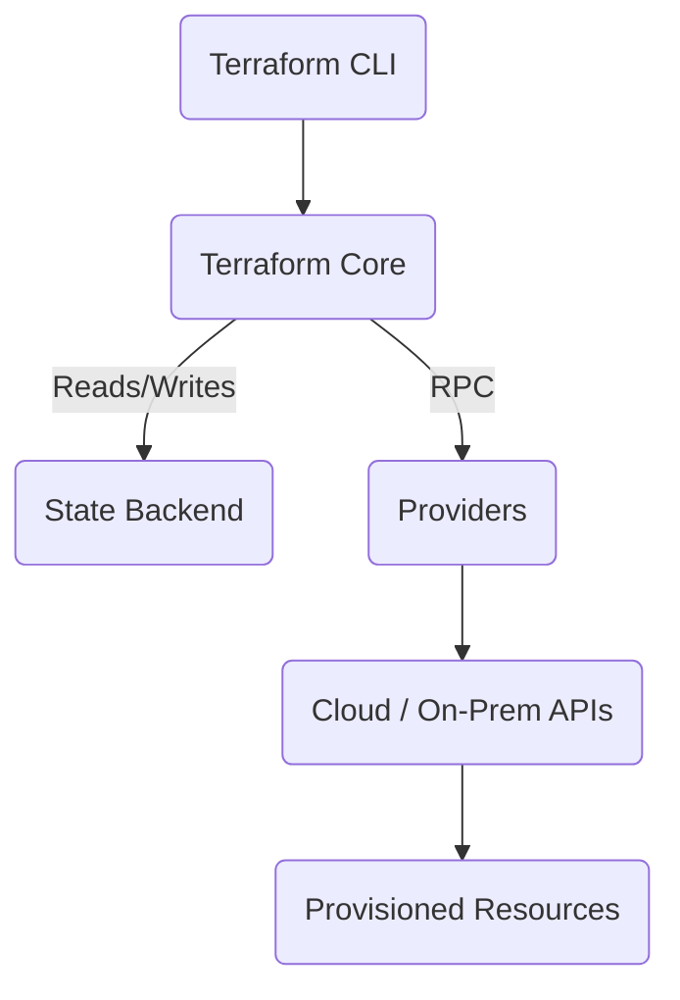

# Terraform and its Architecture 
> - Terraform is an Infrastructure‑as‑Code tool that lets you declaratively manage infrastructure across multiple clouds and on‑prem systems. Created by HashiCorp.
> - Its architecture consists of Terraform Core (the engine), Providers (API connectors), Resources/Data Sources (infrastructure objects), State (source of truth), and a simple workflow (init → plan → apply).
> - Terraform builds a dependency graph, produces execution plans, and then provisions real resources using provider APIs.
> - Supports : HCL – HashiCorp Configuration Language   and JSON format
> - Terraform focuses on declarative infrastructure:
➡️ You define the desired end‑state, and Terraform figures out how to reach it.
---
## 1. What is Terraform?
Terraform is an **Infrastructure‑as‑Code (IaC)** tool by **HashiCorp** that lets you define, provision, and manage infrastructure across clouds (AWS, Azure, GCP), on‑prem (VMware, Nutanix), and SaaS platforms — all using declarative code written in **HCL (HashiCorp Configuration Language)**. You specify the desired end‑state, and Terraform figures out the actions to reach it.

**Key characteristics**
- **Declarative**: Define the desired outcome; Terraform computes the steps.
- **Cloud‑agnostic**: A consistent workflow across many providers.
- **Immutable, reproducible**: Plans and state prevent configuration drift.
- **Version‑controlled**: Store `.tf` files in Git like any software code.

---

## 2. Core Architectural Components
Terraform’s architecture is composed of five primary building blocks:

1. **Terraform Core** – the execution engine that parses HCL, builds a dependency graph, produces an execution plan, and manages state.
2. **Providers (Plugins)** – connectors that implement resources and data sources and speak to external APIs (AWS, Azure, GCP, Kubernetes, GitHub, etc.).
3. **Resources & Data Sources** – concrete infrastructure objects to create/read/update/delete; read‑only data lookups for existing objects.
4. **State Backend** – the source of truth (`terraform.tfstate`) stored locally or remotely (S3+lock, Azure Storage, GCS, HCP Terraform/Terraform Cloud) with locking and versioning.
5. **CLI Workflow** – `init → plan → apply → destroy` (optionally `fmt`, `validate`, `graph`, `import`, `state` subcommands).

### 2.1 Terraform Core
- Loads configuration (.tf files)
- Builds a resource **dependency graph**
- Computes an **execution plan** (create, update, destroy)
- Reads/writes **state**
- Communicates with providers via **RPC**

### 2.2 Providers (Plugins)
- Implement resources and data sources
- Handle authentication and API calls to external platforms
- Are installed during `terraform init`

### 2.3 Resources & Data Sources
- **Resources** represent managed infrastructure (VMs, networks, databases, IAM policies, containers, buckets, etc.)
- **Data sources** query existing information (AMI IDs, existing subnets, users)

### 2.4 State Backend
- Tracks real‑world objects and their attributes
- Enables collaboration, locking, security, and versioning when remote
- Typical remote backends: **AWS S3 + DynamoDB lock**, **Azure Blob Storage**, **GCS**, **Terraform Cloud / HCP Terraform**

### 2.5 CLI Workflow (Lifecycle)
- `terraform init` – initialize working directory, download providers, configure backend
- `terraform plan` – show changes that will be made without applying them
- `terraform apply` – execute the plan and provision/update resources
- `terraform destroy` – remove managed resources

---

## 3. Extended Concepts (Frequently Asked in Interviews)

### 3.1 Modules
- Reusable units (folders) that encapsulate patterns (VPC, EKS, 3‑tier app)
- Promote consistency and reduce duplication across teams

### 3.2 Workspaces
- Isolate state for multiple environments (dev/test/prod) within the same configuration

### 3.3 Provisioners (Use sparingly)
- Run scripts/commands on resources (e.g., `remote-exec`, `local-exec`)
- Prefer configuration management or cloud‑init over heavy use of provisioners

### 3.4 Policy as Code (Sentinel / OPA)
- Enforce governance (naming, tagging, regions, sizes) in HCP Terraform or via OPA/Conftest in pipelines

### 3.5 OpenTofu (FYI)
- Community fork of Terraform (v1.5.6 lineage) under a permissive license; commands and concepts largely compatible

---

## 4. Architecture Diagrams

### 4.1 Cloud‑Style ASCII Diagram
```
                   ┌─────────────────────────────────────────┐
                   │             Terraform CLI               │
                   │  (init · plan · apply · destroy)        │
                   └───────────────┬─────────────────────────┘
                                   │
                                   ▼
                   ┌──────────────────────────────────────────┐
                   │              Terraform Core              │
                   │------------------------------------------│
                   │ • Loads HCL configuration                │
                   │ • Builds dependency graph                │
                   │ • Creates execution plan                 │
                   │ • Manages state                          │
                   │ • RPC communication with providers       │
                   └───────────────┬───────────────┬──────────┘
                                   │               │
              State Backend        │               │         Providers
      (Local/Remote: S3, GCS,      │               │   (AWS, Azure, GCP,
       Azure Blob, Terraform Cloud)│               │    Kubernetes, etc.)
                                   │               │
                 ┌─────────────────▼─┐         ┌───▼─────────────────────┐
                 │   State Storage   │         │   Provider Plugins      │
                 │ terraform.tfstate │         │  (Go-based RPC plugins) │
                 └───────────────────┘         └───────────┬─────────────┘
                                                           │
                                                           ▼
                                        ┌───────────────────────────────────┐
                                        │      Cloud / On‑Prem APIs         │
                                        │ (AWS EC2, S3, Azure RM, GCP ...)  │
                                        └──────────────────┬────────────────┘
                                                           │
                                                           ▼
                                        ┌───────────────────────────────────┐
                                        │    Actual Provisioned Resources   │
                                        │   VMs · Networks · Databases...   │
                                        └───────────────────────────────────┘
```

### 4.2 Mermaid Diagram


---

## 5. Quick Example (AWS EC2)
```hcl
provider "aws" {
  region = "us-east-1"
}

resource "aws_instance" "web" {
  ami           = "ami-1234567890abcdef0"
  instance_type = "t3.micro"
  tags = {
    Name = "web"
  }
}
```

---

## 6. Summary
Terraform is a **declarative, cloud‑agnostic IaC tool**. Its architecture comprises **Core**, **Providers**, **Resources/Data Sources**, **State Backends**, and the **CLI workflow**. Terraform computes a plan from your configuration and state, then uses provider plugins to call cloud/on‑prem APIs and provision actual infrastructure.

---

## 7. References (for further reading)
- Spacelift: Terraform Architecture Overview – components & workflow
- Dev.to: Terraform Architecture Explained – core, plugins, RPC, state
- PyNet Labs: Key components & client‑only model
- GeeksforGeeks: Intro & core concepts overview
- Owais.io: Deep dive including workspaces, modules, policy as code
