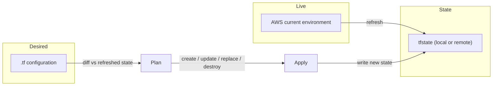

# Terraform State Corner Cases Cheat Sheet (AWS Focus)

**Scope:** Alignment across `.tf` desired configuration, `*.tfstate` stored state, and the current environment (AWS).

Use this as a diagnostic map + playbook. It includes examples for **EC2, ALB, and S3**, commands, and a reconciliation diagram.

---

## 0) Quick mental model: reconciliation lifecycle



---

## 1) Presence matrix (8 core cases)

For a single resource address (e.g., `aws_instance.web[0]`), consider **presence/absence** across the three realms.

| Case | In `.tf` | In `tfstate` | In AWS | Symptom | Plan Result | Typical Fix |
|---|---|---:|---:|---|---|---|
| 1 | ✅ | ✅ | ✅ | Everything aligns | **No changes** | None |
| 2 | ✅ | ✅ | ❌ | State claims it exists, AWS says “not found” | **Recreate** (create new, remove stale state on apply) | Investigate deletion; ensure correct region/account; run `plan` and apply |
| 3 | ✅ | ❌ | ✅ | Drift: resource exists but isn’t tracked | **Import required** | Use `import` block or `terraform import`; reconcile attributes |
| 4 | ✅ | ❌ | ❌ | New resource to create | **Create** | Apply |
| 5 | ❌ | ✅ | ✅ | Resource in state+env but not in config | **Destroy** (unless `prevent_destroy`) | If intentional, adopt via module or `moved`; else allow destroy |
| 6 | ❌ | ✅ | ❌ | Phantom: state says exists, AWS doesn’t | **Destroy state record** (no remote action) | `terraform state rm` |
| 7 | ❌ | ❌ | ✅ | Orphaned external resource | **No action** | Leave unmanaged or adopt via `import` |
| 8 | ❌ | ❌ | ❌ | Absent everywhere | **No changes** | None |

> **Gotcha:** Cases 2,5,6 often happen due to **workspace/account/region mismatches**.

---

## 2) Attribute-level corner cases

### 2.1 In-place vs ForceNew attributes
- **In-place**: drift → **update** (`tags`, user-managed fields). 
- **ForceNew**: drift/change → **replace** (destroy+create). Examples vary by resource; common ForceNew candidates: subnet/VPC association, selected AMI for some resources when immutable, certain listener fields.

**Pitfall:** Config generates a **new value each run** (e.g., `random` inline) for a **ForceNew** field → perpetual **replace**.
- **Remedies:** Persist randomness via `random_id` resource outputs; or `lifecycle { ignore_changes = [attr] }` if acceptable.

### 2.2 Computed/defaulted attributes
Provider sets **computed** fields on read (e.g., ARNs, public IPs). Default changes upstream → apparent drift.
- Pin behavior via provider versions; accept or reconcile.

### 2.3 Write-only / Ephemeral values
**Write-only** provider attributes are **not readable**, so their values are not in state after refresh. Terraform detects change only if **your config value changes**.
- If attribute is **ForceNew** and your config changes → **replace**.
- Avoid per-run regeneration; persist values or route secrets into **SSM Parameter Store**, **Secrets Manager**, or controlled payload (e.g., user data retrieving secrets at boot).

### 2.4 `ignore_changes`
- Suppresses diffs for noisy/external fields.
- **Pitfall:** Ignoring a **ForceNew** field can hide critical drift and prevent needed replacement.

### 2.5 Non-deterministic inputs
- Data sources like “latest AMI” → churn/drift.
- **Remedies:** Pin AMIs; or explicitly accept rolling updates.

### 2.6 Provider schema changes
- Provider updates may switch attribute behavior (in-place vs ForceNew). Test and pin versions.

---

## 3) Lifecycle & replacement mechanics

### 3.1 `create_before_destroy` & deposed
- Replacement can track **deposed** instances (old kept while new created). Crash mid-way → lingering deposed until next apply.

### 3.2 Explicit replacement
- `terraform apply -replace=addr` forces a replace without diff. Use for known-bad objects.

### 3.3 `moved` blocks (renames/refactors)
- Changing resource names/paths or `for_each` keys changes addresses. Use `moved` to **move state without recreate**:
```hcl
moved {
  from = aws_instance.old
  to   = aws_instance.new
}
```

### 3.4 Imports (adoption)
- Terraform ≥ 1.5: `import` blocks allow adopt on plan/apply:
```hcl
import {
  to = aws_instance.web
  id = "i-0abc123..."
}
```
**Pitfall:** Imported live attributes conflict with config → immediate update/replace. Reconcile first.

---

## 4) Backend/workspace/sync pitfalls

- **Workspace mismatch**: same `.tf`, different workspace → different state, duplicate resources.
- **Backend switch**: local → remote without migration → divergent states.
- **Locking & partial failures**: crash after create but before state write → resource exists in AWS but missing in state (needs import).
- **`-refresh=false`** hides drift; **`-refresh-only`** is good for audits.
- **`-target`** partial applies: can leave graph inconsistent; use sparingly.

---

## 5) Authentication/context errors

- **Wrong account/region/profile** → plan against wrong environment; massive unexpected actions.
- **Provider aliases** confusion → resources land in unintended accounts.
- **Credentials changing mid-run** → refresh vs apply inconsistency.

**Remedies:** Print account/region; standardize provider configs; use HCP Terraform/CI with variable sets and stable identities.

---

## 6) Drift scenarios & remedies (AWS examples)

### 6.1 Manual deletion (Env ❌, State ✅, TF ✅)
**Symptom:** Plan shows `+ create` because refresh found missing.
**Remedy:** Apply to recreate, or remove from config.

**Command set:**
```bash
terraform plan
terraform apply
```

### 6.2 Manual change of ForceNew attribute
**Symptom:** Plan shows `-/+ replace`.
**Remedy:** Accept replacement or revert manual change.

### 6.3 Provider-managed fields updated externally
**Symptom:** In-place update planned (e.g., tags changed externally).
**Remedy:** Decide ownership; use `ignore_changes = [tags]` if tags are centrally managed.

### 6.4 Out-of-band ID change
**Symptom:** Refresh returns “not found” → recreate.
**Remedy:** Adopt via import with new ID.

### 6.5 Removed in config but protected
**Symptom:** Resource removed from `.tf`, but `prevent_destroy = true` blocks deletion.
**Remedy:** Temporarily remove `prevent_destroy` or handle via override/replacement strategy.

---

## 7) Subtle edge cases

- **Deposed instances linger** after interrupted replacement.
- **Schema evolution** changes attribute behavior.
- **Sensitive/write-only attributes** redacted on read → drift only detected via config changes.
- **External controllers** (ASG, EKS) manage instances; represent the controller in TF, not children.
- **Module version bumps** change defaults → drift; pin versions.
- **Randomized names** cause rolling replacements unless persisted.

---

## 8) Diagnostic workflow (AWS)

1) **Confirm context**
```bash
terraform workspace show
aws sts get-caller-identity
aws configure list
``` 

2) **Inspect state & drift**
```bash
terraform state list
terraform state show aws_instance.web
terraform plan -refresh-only
```

3) **Adopt or purge**
```bash
# Adopt existing
# (TF >= 1.5) add an import block and `terraform apply`
# (older) classic import:
terraform import aws_instance.web i-0abc123...

# Remove phantom state (env missing)
terraform state rm aws_instance.web
```

4) **Surgical replacement**
```bash
terraform apply -replace=aws_instance.web
```

5) **Move addresses**
```hcl
moved {
  from = aws_instance.old
  to   = aws_instance.new
}
```

---

## 9) Preventive practices

- Pin provider versions and review changelogs.
- Standardize workspaces/backends; enable state locking (e.g., S3 + DynamoDB or HCP Terraform).
- Refresh before plan; use `-refresh-only` to audit drift regularly.
- Persist non-deterministic inputs (randoms, latest AMI lookups).
- Use `moved` blocks during refactors.
- Guard ForceNew attributes that shouldn’t change frequently.
- Separate ownership; document `ignore_changes` rationale.

---

## 10) Concrete AWS examples (EC2, ALB, S3)

> These snippets focus on **corner-case behavior** rather than full production hardening (e.g., IAM, security groups).

### 10.1 EC2: AMI pin vs latest (ForceNew behavior)

```hcl
provider "aws" {
  region = var.region
}

# Pin AMI to avoid unintended replacements
variable "ami_id" { type = string }

resource "aws_instance" "web" {
  ami           = var.ami_id        # changing this often forces replacement
  instance_type = "t3.micro"
  tags = {
    Name = "web"
  }
  # If you truly want rolling, you can manage via lifecycle, but be cautious:
  # lifecycle { ignore_changes = [ami] }
}

# Alternative risky pattern (non-deterministic): latest AMI
# data "aws_ami" "amazon_linux_latest" {
#   owners      = ["amazon"]
#   most_recent = true
#   filter { name = "name" values = ["amzn2-ami-hvm-*-x86_64-gp2"] }
# }
# resource "aws_instance" "web_latest" {
#   ami           = data.aws_ami.amazon_linux_latest.id
#   instance_type = "t3.micro"
# }
```

**Corner-case note:** switching from pinned AMI to `most_recent` can cause replacement whenever a new AMI appears.

### 10.2 ALB: Listener changes (may be ForceNew)

```hcl
resource "aws_lb" "app" {
  name               = "app-lb"
  internal           = false
  load_balancer_type = "application"
  subnets            = var.public_subnet_ids
}

resource "aws_lb_target_group" "tg" {
  name     = "app-tg"
  port     = 80
  protocol = "HTTP"
  vpc_id   = var.vpc_id
}

resource "aws_lb_listener" "http" {
  load_balancer_arn = aws_lb.app.arn
  port              = 80
  protocol          = "HTTP"

  default_action {
    type             = "forward"
    target_group_arn = aws_lb_target_group.tg.arn
  }

  # Changing protocol/port or default action type can lead to replacement
  # lifecycle { ignore_changes = [default_action] } # Only if external controller manages this
}
```

**Corner-case note:** some listener attribute changes are not in-place, causing replacement.

### 10.3 S3: Server-side encryption & write-only secrets pattern

```hcl
resource "aws_s3_bucket" "logs" {
  bucket = "my-logs-${var.workspace}"
}

resource "aws_s3_bucket_server_side_encryption_configuration" "logs_sse" {
  bucket = aws_s3_bucket.logs.id

  rule {
    apply_server_side_encryption_by_default {
      sse_algorithm     = "aws:kms"
      kms_master_key_id = var.kms_key_id  # changing key may force replacement of SSE config block
    }
  }
}

# Write-only secret pattern: avoid putting secrets into state via redacted/read-only attributes.
# Prefer storing secrets in AWS Secrets Manager or SSM Parameter Store and referencing them at runtime (e.g., user data).
```

**Corner-case note:** moving between KMS keys or AES256 may require configuration replacement; ensure stable inputs.

---

## 11) Sample plan outputs to recognize

### 11.1 Replace due to ForceNew
```
-/+ resource "aws_instance" "web" {
      ~ ami           = "ami-0abc123" -> "ami-0def456" # forces replacement
      ~ id            = "i-0aaa..." -> (known after apply)
      ~ instance_type = "t3.micro"
        tags = {
            Name = "web"
        }
    }
```

### 11.2 Create because env missing but in config+state
```
+ resource "aws_instance" "web" {
    ami           = "ami-0abc123"
    instance_type = "t3.micro"
    # ...
}

# (refresh discovered the old ID no longer exists)
```

### 11.3 Import required (env has it, state lacks it)
```
Plan: 0 to add, 0 to change, 0 to destroy.

# But resource shown in AWS; Terraform has no address.
# Proceed to import:
terraform import aws_instance.web i-0abc123...
```

---

## 12) Quick triage checklist

- ✅ Correct **workspace/backend/account/region**?
- ✅ Run `terraform plan -refresh-only` to see true drift?
- ✅ Use **`moved` blocks** for refactors/renames?
- ✅ Any **ForceNew** attributes unintentionally changing?
- ✅ Any **write-only/ephemeral** fields regenerating each run?
- ✅ External controllers managing fields (tags, listeners, scaling)?
- ✅ CI using `-target` or `-refresh=false`?
- ✅ State **locked** and backend consistent for the team?

---

## 13) Useful commands (copy/paste)

```bash
# Show workspace and identity
terraform workspace show
aws sts get-caller-identity

# Drift-only audit
terraform plan -refresh-only

# Remove phantom record from state
terraform state rm aws_instance.web

# Import existing
terraform import aws_instance.web i-0abc123...

# Force replacement
terraform apply -replace=aws_instance.web

# Move addresses without recreate
# (add to configuration)
moved {
  from = aws_instance.old
  to   = aws_instance.new
}
```

---

### Notes for exam/context (Terraform Associate 004)
- Understand **state purpose**: record resource identities & attributes, speed up planning, enable mapping of config to real-world objects.
- Know **drift** handling via refresh and **`-refresh-only`**.
- Recognize **import** vs **create** vs **replace** signals in plan outputs.
- Lifecycle meta-arguments: `create_before_destroy`, `prevent_destroy`, `ignore_changes`.
- Safe refactors: **`moved` blocks**.

---

**Want this expanded with your exact AWS VPC/SG patterns and CI/HCP Terraform setup?** Ping me and I’ll tailor the snippets.
