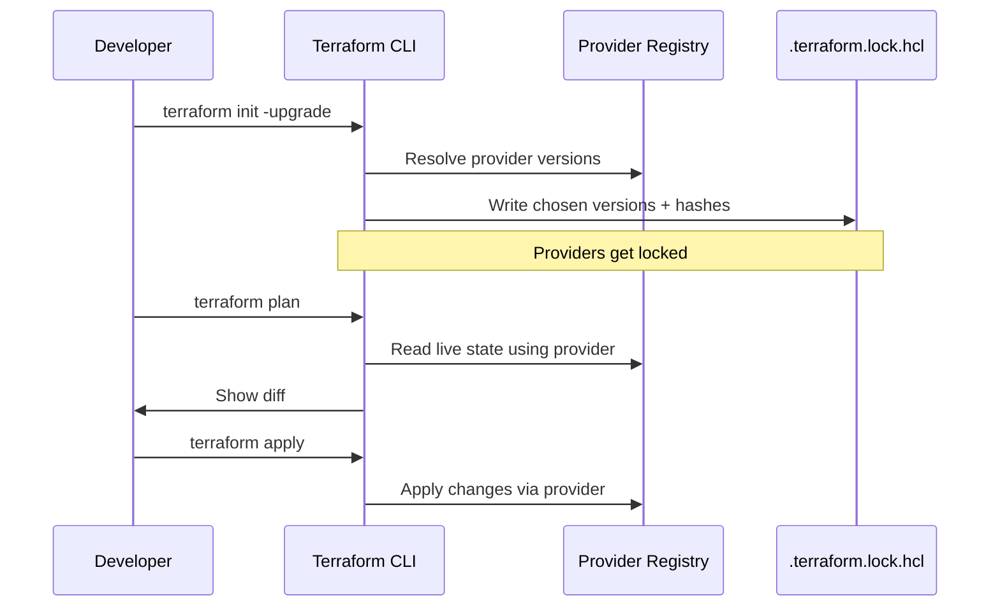
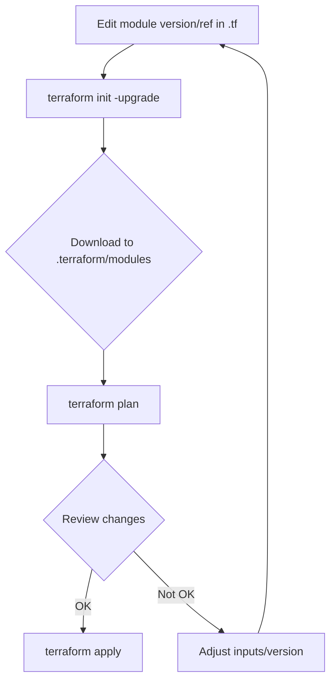

# Terraform Versioning & Upgrade Guide (Providers First, Then Modules)

## 1. Overview
This document explains in a clean, structured, certification-ready format:

- How **providers** are declared, versioned, locked, upgraded
- How **modules** are declared, versioned, upgraded
- How Terraform treats providers vs modules differently
- Where versions are stored (and not stored)
- How upgrades behave during `init`, `plan`, and `apply`
- Mermaid diagrams for clarity

---

# 2. Providers — Versioning, Locking & Upgrade Handling

Providers are **binaries**. Terraform treats them as installable plugins and locks them for reproducibility.

---
## 2.1 Declaring Provider Requirements
```hcl
terraform {
  required_version = ">= 1.5.0"

  required_providers {
    aws = {
      source  = "hashicorp/aws"
      version = "~> 5.44"  # allows 5.44.x
    }

    random = {
      source  = "hashicorp/random"
      version = "3.6.2"     # pinned
    }
  }
}
```

---
## 2.2 What `.terraform.lock.hcl` Stores
Terraform’s lock file records:
- Provider **source address** (e.g., `registry.terraform.io/hashicorp/aws`)
- Provider **exact version** chosen (e.g., `5.44.0`)
- Provider **hashes** for security

**Modules do NOT appear here.**

This ensures:
- Same provider binaries on all machines
- Reproducible CI pipelines
- Secure verification of provider downloads

---
## 2.3 Upgrading Providers Safely

### Step 1 — Relax or bump constraints
Examples:
- `~> 5.42` → `~> 5.44`
- `>= 5.44, < 6.0`
- `= 5.44.0` (pin exactly)

### Step 2 — Run upgrade resolution
```bash
terraform init -upgrade
```
This updates:
- Provider version in the dependency solver
- `.terraform.lock.hcl` with new version + hashes

### Step 3 — Review changes
```bash
terraform plan
```
### Step 4 — Apply
```bash
terraform apply
```

> ⚠️ **NOTE:** Running `terraform init` *without* `-upgrade` does **NOT** pick newer provider versions even within constraints.

---
## 2.4 Provider Constraint Patterns
- **Exact pin:** `= 5.44.0`
- **Patch series:** `~> 5.44` → allows `5.44.x`
- **Minor series:** `~> 5.0` → allows `5.x.y`
- **Ranges:** `>= 5.44, < 6.0`

---
## 2.5 Provider Installation & Cache
- Installed into `.terraform/providers/`
- Verified using lock file hashes
- Reinstalled when constraints change or `-upgrade` is used

---
## 2.6 Changing Provider Source
```hcl
terraform {
  required_providers {
    aws = {
      source  = "mycompany/custom-aws"
      version = ">= 5.0"
    }
  }
}
```
Now re-lock:
```bash
terraform init -upgrade
```

---

# 3. Modules — Versioning & Upgrade Handling

Modules are **source code**, not binaries. Terraform **does NOT lock modules** in `.terraform.lock.hcl`.

---
## 3.1 Where Module Versions Are Declared
```hcl
module "vpc" {
  source  = "terraform-aws-modules/vpc/aws"
  version = "5.1.2"
}
```
Modules may also come from Git:
```hcl
module "app" {
  source = "git::https://github.com/org/repo.git//modules/app?ref=v1.3.0"
}
```

---
## 3.2 Where Terraform Stores Modules
After `terraform init`, code is downloaded into:
```
.terraform/modules/
```
This folder mirrors:
- Your `source`
- Your `version` or Git `ref`

**It is NOT version-locked.**

---
## 3.3 Why Modules Are NOT in the Lock File
- They are plain Terraform/HCL code
- Not binary plugins
- No hash validation system like providers have
- Terraform expects users to explicitly manage module versioning

---
## 3.4 Upgrading Modules

### Step 1 — Change module version or Git ref
```hcl
version = "5.1.2"
# or
ref = "v1.3.0"
```

### Step 2 — Fetch the updated module
```bash
terraform init -upgrade
```

### Step 3 — Preview changes
```bash
terraform plan
```

### Step 4 — Apply
```bash
terraform apply
```

---

# 4. Combined Quick Mental Model (Providers vs Modules)

| Thing | Providers | Modules |
|------|-----------|----------|
| Declared in | `required_providers` block | `module` block |
| Stored in | `.terraform/providers/` | `.terraform/modules/` |
| Locked in `.terraform.lock.hcl` | **Yes** | **No** |
| Upgrade method | Change version constraint → `terraform init -upgrade` | Change version/ref → `terraform init -upgrade` |
| Type | Binary plugin | Source code |
| Hash-verified | Yes | No |

> Key idea: **Providers = locked binaries**, **Modules = unlocked source code**.
> **Modules are source code** (not locked). **Providers are binaries** (locked by Terraform for reproducibility).
---

# 5. End-to-End Upgrade Scenarios

## 5.1 Upgrade a Module (minor bump)
```hcl
module "alb" {
  source  = "terraform-aws-modules/alb/aws"
  version = "~> 9.1"   # previously ~> 9.0
}
```
```bash
terraform init -upgrade
terraform plan
terraform apply
```

---

## 5.2 Upgrade a Provider Within Range
```hcl
terraform {
  required_providers {
    aws = {
      source  = "hashicorp/aws"
      version = "~> 5.44"
    }
  }
}
```
```bash
terraform init -upgrade      # updates lock file
terraform plan
terraform apply
```

---

## 5.3 Pin a Provider Exactly
```hcl
version = "= 5.44.0"
```
Guarantees identical binaries across all machines.

---

# 6. Diagrams (Mermaid)

## 6.1 Provider Workflow (Resolution + Locking)


---

## 6.2 Module Upgrade Workflow


---

# 7. Key Takeaways
- Providers **are** locked by Terraform. Modules **are not**.
- Provider upgrades always modify `.terraform.lock.hcl`.
- Module upgrades only modify:
  - `.tf` files
  - `.terraform/modules/` folder
- Use `terraform init -upgrade` for **both** provider & module upgrades.

---

# 8. References
- Provider Locking — https://developer.hashicorp.com/terraform/cli/commands/providers/lock
- Module Sources — https://developer.hashicorp.com/terraform/language/modules/sources
- Version Constraints — https://developer.hashicorp.com/terraform/language/expressions/version-constraints
- terraform init — https://developer.hashicorp.com/terraform/cli/commands/init
