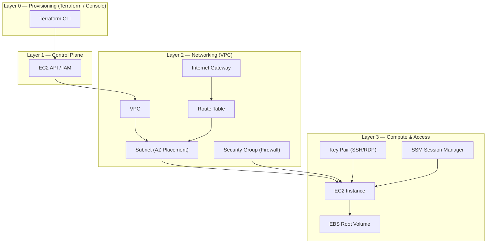

# EC2 Instance Tutorial (AWS Console vs Terraform)

---

## ✨ What You'll Learn
- The **absolute minimum** required to create an EC2 instance
- **Why** each item is required (GUI and Terraform)
- **Side-by-side**: AWS Console vs Terraform steps
- A **minimal Terraform configuration** that works in the default VPC

---

## ✅ Minimum Requirements + Why They Are Needed

### AWS Console (GUI)
1. **AMI (Amazon Machine Image)** — ***Why***: It provides the bootable OS and pre-installed software for the instance. Without an AMI, the instance has no operating system to run.
2. **Instance type** —***Why***: Defines the hardware (CPU, RAM, network performance). AWS must allocate the right kind of host resources for your workload.
3. **Key pair** (SSH for Linux / RDP for Windows) — A set of security credentials that you use to prove your identity when connecting to your instance. The public key is on your instance and the private key is on your computer. ***Why***: You need credentials to securely access the instance. A key pair enables passwordless, cryptographic login. (Optional if using **Systems Manager Session Manager**.)
4. **Network**: VPC + Subnet + Security Group rule — ***Why***: Instances must live in a network (VPC). A subnet places the instance in a specific AZ. Security groups act as a virtual firewall to permit or deny traffic (e.g., SSH `22/tcp`). Optionally enable **public IP** for internet reachability. </br> A virtual private cloud (VPC) is a virtual network dedicated to your AWS account. To help you get started quickly, your account comes with a default VPC in each AWS Region, and each default VPC has a default subnet in each Availability Zone.
5. **Region** — ***Why***: Resources are regional. AMIs, instance types availability, pricing, and IPs are tied to a selected region.
6. **Storage (root volume)** — ***Why***: The instance needs a root disk to boot the OS (EBS or instance store). Size/type affects performance and cost.
7. **Tags** — ***Why***: Useful for cost allocation, ownership, automation, and resource discovery.
> ⚠️ Note: AMI IDs are **region-specific**. Replace the example AMI with one valid for your chosen AWS region.

### Terraform
1. **Provider + credentials** — *Why*: Terraform must authenticate to AWS to plan/apply changes. Provider config also sets the target region.
2. **AMI ID** — *Why*: Points to the exact image to boot. AMIs differ by region and OS.
3. **Instance type** — *Why*: Hardware sizing for compute/memory.
4. **Network**: VPC/Subnet + Security Group — *Why*: Placement and connectivity. SG rules define allowed inbound/outbound traffic.
5. **Optional: key_name** — *Why*: To SSH/RDP with a key pair. Skip if using SSM only.
6. **Optional: user_data** — *Why*: Bootstrap scripts to configure the instance at first boot.
7. **Optional: IAM role/profile** — *Why*: Grant the instance permissions to access AWS services (e.g., S3, CloudWatch) without embedding credentials.
8. **Optional: root_block_device** — *Why*: Control disk size/type/encryption.
9. **Tags** — *Why*: Governance, cost, automation (same as GUI).
> ⚠️ Note: AMI IDs are **region-specific**. Replace the example AMI with one valid for your chosen AWS region.

---


## 📊 EC2 Creation: GUI vs Terraform (Side-by-Side)

| Step | AWS Console (GUI) | Terraform (IaC) |
|---|---|---|
| 1. Access | Browser login to AWS Console | Install Terraform; configure AWS creds |
| 2. Region | Select from top-right | `provider "aws" { region = "us-east-1" }` |
| 3. AMI | Choose image (Amazon Linux/Ubuntu) | `ami = "<ami-id>"` |
| 4. Instance Type | Pick from dropdown | `instance_type = "t2.micro"` |
| 5. Key Pair | Create/select key pair | `key_name = "mykey"` (optional) |
| 6. VPC | Default VPC auto-selected | `data "aws_vpc" "default" { default = true }` |
| 7. Subnet | Default subnet auto-selected | `data "aws_subnets" "default" { filter... }` |
| 8. Security Group | Create/select | `resource "aws_security_group" ...` |
| 9. Storage | Add volume in wizard | `root_block_device { ... }` |
| 10. Tags | Add in wizard | `tags = { Name = "EC2" }` |
| 11. Launch | Click **Launch Instance** | `terraform apply` |
| 12. Modify | Manual changes | Edit `.tf` and `terraform apply` |
| 13. Delete | Terminate | `terraform destroy` |

---

## 🧩 Minimal Terraform Example (Default VPC)

Create `main.tf`:

```hcl
terraform {
  required_version = ">= 1.6.0"
  required_providers {
    aws = {
      source  = "hashicorp/aws"
      version = ">= 5.0"
    }
  }
}

provider "aws" {
  region = "us-east-1"
}

# Use the default VPC
data "aws_vpc" "default" {
  default = true
}

# Use default subnets (one per AZ)
data "aws_subnets" "default" {
  filter {
    name   = "default-for-az"
    values = ["true"]
  }
}

# Minimal Security Group allowing SSH
resource "aws_security_group" "allow_ssh" {
  name        = "allow_ssh"
  description = "Allow SSH inbound"
  vpc_id      = data.aws_vpc.default.id

  ingress {
    description = "SSH from anywhere"
    from_port   = 22
    to_port     = 22
    protocol    = "tcp"
    cidr_blocks = ["0.0.0.0/0"]
  }

  egress {
    description = "Allow all outbound"
    from_port   = 0
    to_port     = 0
    protocol    = "-1"
    cidr_blocks = ["0.0.0.0/0"]
  }
}

# Key Pair
resource "aws_key_pair" "this" {
  key_name   = "mykey"
  public_key = file("~/.ssh/mykey.pub")
}

# EC2 instance
resource "aws_instance" "ec2" {
  ami           = "ami-0c02fb55956c7d316"  # Replace with region-appropriate AMI
  instance_type = "t2.micro"
  subnet_id     = data.aws_subnets.default.ids[0]
  vpc_security_group_ids = [aws_security_group.allow_ssh.id]
  key_name                    = aws_key_pair.this.key_name

  tags = {
    Name = "Terraform-EC2"
  }
}

# Useful outputs
output "instance_id" {
  value = aws_instance.ec2.id
}

output "public_ip" {
  value = aws_instance.ec2.public_ip
}

output "public_dns" {
  value = aws_instance.ec2.public_dns
}
```

> 🔐 **Credentials**: Authenticate via `aws configure`, environment variables (`AWS_ACCESS_KEY_ID`, `AWS_SECRET_ACCESS_KEY`, `AWS_SESSION_TOKEN`), or an IAM role if running from an EC2/Cloud environment.

---

## 🛠️ Commands

```bash
# Initialize providers and modules
terraform init

# Preview the plan
terraform plan

# Apply (create resources)
terraform apply -auto-approve

# Show outputs (public IP/DNS)
terraform output

# Destroy when done
terraform destroy -auto-approve
```

---

## 🖼️ Architecture Diagram (Mermaid)



---
## 🧪 SSH Test Commands
```bash
ssh-keygen -t ed25519 -f ~/.ssh/mykey
chmod 600 ~/.ssh/mykey
ssh -i ~/.ssh/mykey ec2-user@$(terraform output -raw public_ip)
```
> Click for more on [ssh-keygen](https://github.com/mohakhan03uk/terraform/blob/main/aws/ManualKeyPairAndItsUseInEC2.md)
---

## 🔄 Notes & Tips
- **AMI IDs** change per **region**; use a data source (`data "aws_ami"`) to query latest images.
- Prefer **least privilege** SG rules (e.g., restrict SSH to your IP instead of `0.0.0.0/0`).
- Consider **Session Manager** (no public IP, no SSH keys) for secure access.
- Tag resources consistently (e.g., `Environment`, `Owner`).
---
---

## ✅ Next Steps
- Add a `variables.tf` for region, instance type, and AMI
- Add `key_name` (if you plan to SSH with a key pair)
- Use **modules** for reusable patterns (EC2 + SG + outputs)
- Add `iam_instance_profile` if the instance needs AWS API access

