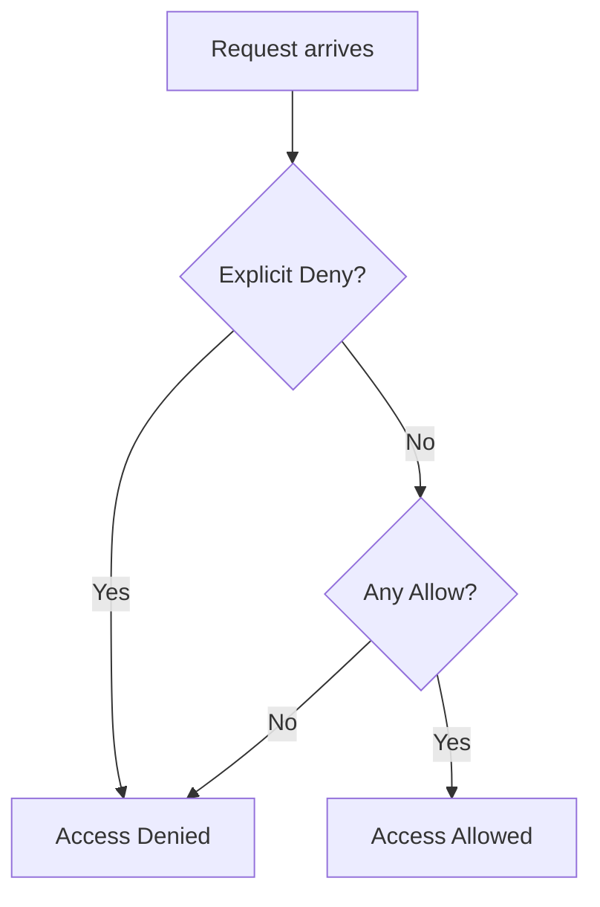
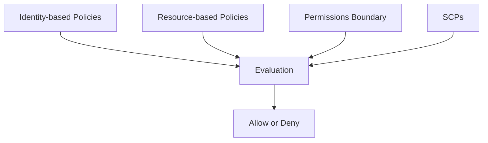

# AWS IAM Policies — What, Why, When, How 
---
# 📌 Overview
**IAM Policies** are JSON documents in AWS that define **permissions** — what actions are allowed or denied, and on which resources.  
Policies are the foundation of how AWS secures access to its services.

This file explains **policy types, structure, evaluation logic, examples, best practices, scenarios, diagrams, Terraform/CLI examples**, and more — same detail level as IAM Role/User/Group guides.

---

# 🧠 What is an IAM Policy?
An **IAM Policy** is a JSON document that specifies:
- **Actions** → what operations are allowed or denied
- **Resources** → which AWS objects the actions apply to
- **Effect** → `Allow` or `Deny`
- **Conditions** → optional constraints (IP address, VPC endpoint, time, MFA, tags)

Policies are attached to:
- **Users**
- **Groups**
- **Roles**

AWS evaluates these policies to determine if a request is allowed.

---

# 📦 Types of IAM Policies

## 1️⃣ Identity‑based Policies
Attached to **users**, **groups**, or **roles**. These control what that identity can do.

Two subtypes:
- **AWS managed policies** (predefined by AWS)
- **Customer managed policies** (created by you)
- **Inline policies** (embedded directly in a user/group/role)

---

## 2️⃣ Resource‑based Policies
Policies attached **directly to resources**, such as:
- S3 Bucket policy
- SQS Queue policy
- SNS Topic policy
- Lambda permission policy
- API Gateway IAM policy

These specify **who can access the resource**.

---

## 3️⃣ Permissions Boundaries
A **maximum permission limit** for a user or role.

The identity’s effective permission = **intersection of**:
- Identity‑based policy
- Permission boundary

Common for multi-tenant or delegated admin environments.

---

## 4️⃣ Service Control Policies (SCPs)
Available via **AWS Organizations**. They:
- Set global rules for accounts
- Can only deny, not grant access

Even if IAM policies allow an action, SCP can block it.

---

## 5️⃣ Session Policies
Temporary, inline policies applied via **AWS STS** during role assumption.
They provide short-lived restrictions.

---

# 🧬 IAM Policy JSON Structure

Example minimal policy:
```json
{
  "Version": "2012-10-17",
  "Statement": [
    {
      "Effect": "Allow",
      "Action": "s3:ListBucket",
      "Resource": "arn:aws:s3:::my-bucket"
    }
  ]
}
```

### Fields explained:
- **Version** — Always `2012-10-17` for modern policies.
- **Statement** — Array of one or more rules.
- **Effect** — `Allow` or `Deny`.
- **Action / NotAction** — AWS actions.
- **Resource / NotResource** — ARNs.
- **Condition** — Key/value conditional constraints.

---

# 🎯 Allow vs Deny Logic
AWS evaluates permissions using the following rules:

1. **Explicit Deny overrides everything**
2. If no rule matches → **Implicit deny**
3. At least one **Allow** AND no **Deny** → access granted

Diagram:


---

# 🧩 Common AWS Managed Policies
- **AdministratorAccess** → Full access
- **PowerUserAccess** → Everything except IAM
- **ReadOnlyAccess** → No write operations
- **AmazonEC2FullAccess**
- **AmazonS3ReadOnlyAccess**
- **AmazonRDSFullAccess**

Good for starting; for production, prefer **custom least‑privilege policies**.

---

# 🧱 Resource‑based Policy Example (S3 Bucket)
```json
{
  "Version": "2012-10-17",
  "Statement": [
    {
      "Effect": "Allow",
      "Principal": "*",
      "Action": ["s3:GetObject"],
      "Resource": "arn:aws:s3:::my-bucket/*"
    }
  ]
}
```

---

# 🔐 Condition Keys — The Real Power
Conditions allow powerful rules. Examples:

### Enforce MFA
```json
"Condition": { "Bool": { "aws:MultiFactorAuthPresent": "true" }}
```

### Restrict to VPC Endpoint
```json
"Condition": { "StringEquals": { "aws:SourceVpce": "vpce-12345" } }
```

### Restrict by IP
```json
"Condition": {
  "IpAddress": { "aws:SourceIp": "203.0.113.0/24" }
}
```

### Restrict S3 prefixes
```json
"Condition": {
  "StringLike": { "s3:prefix": "prod/*" }
}
```

---

# 🧪 Full Example: Least Privilege S3 Read Policy
```json
{
  "Version": "2012-10-17",
  "Statement": [
    {
      "Sid": "ListAndRead",
      "Effect": "Allow",
      "Action": [
        "s3:ListBucket",
        "s3:GetObject"
      ],
      "Resource": [
        "arn:aws:s3:::my-bucket",
        "arn:aws:s3:::my-bucket/data/*"
      ]
    }
  ]
}
```

---

# 🧭 Policy Combining Logic
Diagram explaining identity + resource + boundary + SCP:


---

# 🛠️ Create Custom Policies

### AWS Console
1. IAM → Policies → Create Policy
2. JSON → Paste your document
3. Validate syntax
4. Save and attach to user/group/role

---

### AWS CLI
```bash
aws iam create-policy   --policy-name S3ReadPolicy   --policy-document file://s3-read.json
```

---

### Terraform
```hcl
resource "aws_iam_policy" "s3_read" {
  name = "my-s3-read-policy"
  policy = jsonencode({
    Version = "2012-10-17",
    Statement = [{
      Effect = "Allow",
      Action = ["s3:ListBucket", "s3:GetObject"],
      Resource = [
        "arn:aws:s3:::my-bucket",
        "arn:aws:s3:::my-bucket/*"
      ]
    }]
  })
}
```

---

# 📚 Real‑World Scenarios

## Scenario 1: Allow developers to manage EC2 but block deletion
Use explicit deny:
```json
{
  "Effect": "Deny",
  "Action": "ec2:TerminateInstances",
  "Resource": "*"
}
```

## Scenario 2: Allow access to S3 only from a specific VPC endpoint
```json
"Condition": { "StringEquals": { "aws:SourceVpce": "vpce-abc123" } }
```

## Scenario 3: Restrict production access unless MFA is on
```json
"Condition": { "Bool": { "aws:MultiFactorAuthPresent": "true" }}
```

---

# ⚠️ Best Practices
- Follow **least privilege**
- Avoid `"Resource": "*"` unless necessary
- Deny critical actions explicitly (e.g., `s3:DeleteBucket`)
- Prefer **customer‑managed** over **inline** policies
- Monitor with IAM Access Analyzer
- Use conditions for network, MFA, tagging requirements

---

# 📎 References
- AWS IAM Policies: https://docs.aws.amazon.com/IAM/latest/UserGuide/access_policies.html
- Policy Evaluation Logic: https://docs.aws.amazon.com/IAM/latest/UserGuide/reference_policies_evaluation-logic.html
- Managed Policies: https://docs.aws.amazon.com/IAM/latest/UserGuide/access_policies_managed-vs-inline.html

---

# 📌 Footer
**© MohammadImran Khan** — IAM Policies GitHub Documentation.
