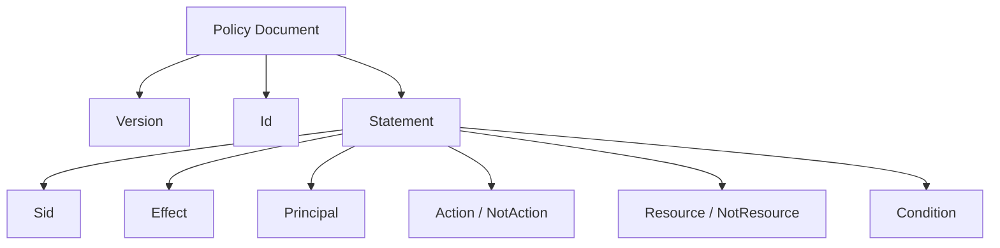

# 📘 Overview
This guide explains the **complete structure of an IAM Policy**, every field (argument), their purpose, examples, and diagrams. Designed for GitHub documentation.

---

# 🧱 1. Full IAM Policy Structure (All Possible Fields)
```json
{
  "Version": "2012-10-17",
  "Id": "OptionalPolicyIdentifier",
  "Statement": [
    {
      "Sid": "OptionalStatementIdentifier",
      "Effect": "Allow or Deny",
      "Principal": "Only for resource-based policies",
      "NotPrincipal": "Opposite of Principal",
      "Action": ["service:operation"],
      "NotAction": ["service:operation"],
      "Resource": ["arn:aws:..."],
      "NotResource": ["arn:aws:..."],
      "Condition": {
        "condition-operator": {
          "condition-key": "value"
        }
      }
    }
  ]
}
```

This is the maximum structure. Most policies use only **Version**, **Statement**, **Effect**, **Action**, **Resource**.

---

# 🧩 2. Explanation of All Policy Fields

## 🔹 Version (Required)
Indicates the policy language version.
```
"Version": "2012-10-17"
```
This is the latest and only recommended version.

---

## 🔹 Id (Optional)
A unique identifier for the policy document.
```
"Id": "S3Policy123"
```
Used for tracking and auditing.

---

# 📦 Statement Block (Required)
Every policy contains one or more statements.

---

## 🔹 Sid (Optional)
Identifier for a statement.
```
"Sid": "AllowS3Read"
```
Useful for debugging and documentation.

---

## 🔹 Effect (Required)
Defines whether the action is allowed or denied.
```
"Effect": "Allow"
```
Values:
- `Allow`
- `Deny`

❗ **Explicit Deny always overrides Allow**.

---

## 🔹 Principal (Only for resource-based policies)
Specifies **who** can access the resource.
```
"Principal": { "AWS": "arn:aws:iam::111122223333:user/Alice" }
```
Examples:
- IAM user
- IAM role
- Entire account
- Service principal (`ec2.amazonaws.com`)

---

## 🔹 NotPrincipal (Rare)
Opposite of Principal.
```
"NotPrincipal": { "AWS": "arn:aws:iam::111122223333:user/Alice" }
```
Meaning = applies to **everyone except Alice**.

---

## 🔹 Action (Most Important Field)
Defines what operations are allowed or denied.
```
"Action": ["s3:GetObject", "s3:ListBucket"]
```
Supports wildcards:
```
"Action": "ec2:*"
```

---

## 🔹 NotAction (Rare)
Opposite of Action. Means **all actions except these**.
```
"NotAction": "s3:DeleteObject"
```
Often used in SCPs.

---

## 🔹 Resource (Required in most identity policies)
Defines which AWS resources the actions apply to.
```
"Resource": [
  "arn:aws:s3:::my-bucket",
  "arn:aws:s3:::my-bucket/*"
]
```
Wildcard allowed:
```
"Resource": "*"
```

---

## 🔹 NotResource (Rare)
Opposite of Resource. Applies to all except the listed ARNs.
```
"NotResource": "arn:aws:s3:::my-bucket/*"
```

---

## 🔹 Condition (Optional but Very Powerful)
Specifies **when** the policy applies.
```
"Condition": {
  "StringEquals": {
    "aws:SourceVpce": "vpce-12345"
  }
}
```

### Common Condition Operators:
- `StringEquals`
- `StringLike`
- `Bool`
- `IpAddress`
- `ArnEquals`
- `NumericEquals`

### Examples:
#### Require MFA
```
"Condition": { "Bool": { "aws:MultiFactorAuthPresent": "true" }}
```

#### Restrict by IP
```
"Condition": { "IpAddress": { "aws:SourceIp": "203.0.113.0/24" }}
```

#### Restrict to VPC endpoint
```
"Condition": { "StringEquals": { "aws:SourceVpce": "vpce-abc123" }}
```

---

# 🧩 3. Minimal IAM Policy Example
```json
{
  "Version": "2012-10-17",
  "Statement": [
    {
      "Effect": "Allow",
      "Action": "s3:ListBucket",
      "Resource": "arn:aws:s3:::my-bucket"
    }
  ]
}
```

---

# 🧩 4. Full Advanced IAM Policy Example
```json
{
  "Version": "2012-10-17",
  "Id": "FullPolicyExample01",
  "Statement": [
    {
      "Sid": "AllowReadOnlyViaVPCE",
      "Effect": "Allow",
      "Principal": {
        "AWS": "arn:aws:iam::111122223333:user/Imran"
      },
      "Action": ["s3:GetObject", "s3:ListBucket"],
      "Resource": [
        "arn:aws:s3:::prod-data",
        "arn:aws:s3:::prod-data/*"
      ],
      "Condition": {
        "StringEquals": { "aws:SourceVpce": "vpce-abc123" },
        "Bool": { "aws:MultiFactorAuthPresent": "true" }
      }
    }
  ]
}
```

---

# 🧭 5. Diagram — IAM Policy Structure


---

# 🧾 6. Summary Table
| Field | Required | Purpose |
|-------|----------|---------|
| Version | ✔ | Policy language version |
| Id | ❌ | Identifier for policy |
| Statement | ✔ | Contains rules |
| Sid | ❌ | Identifier for a statement |
| Effect | ✔ | Allow / Deny |
| Principal | Only in resource policies | Who can access |
| Action | ✔ (usually) | Allowed or denied operations |
| Resource | ✔ (usually) | AWS resources allowed/denied |
| Condition | Optional | Restrict policy based on context |
| NotAction | Rare | Opposite of Action |
| NotResource | Rare | Opposite of Resource |
| NotPrincipal | Rare | Opposite of Principal |

---

# 📌 Footer
**© MohammadImran Khan**
