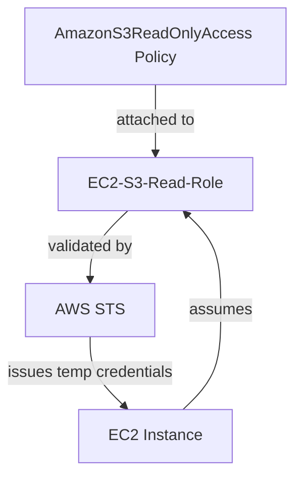
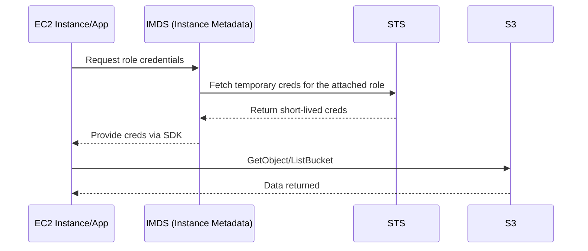
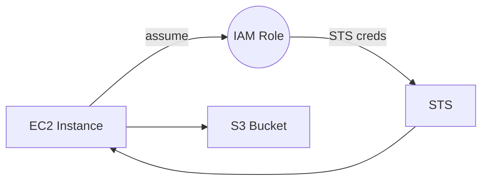
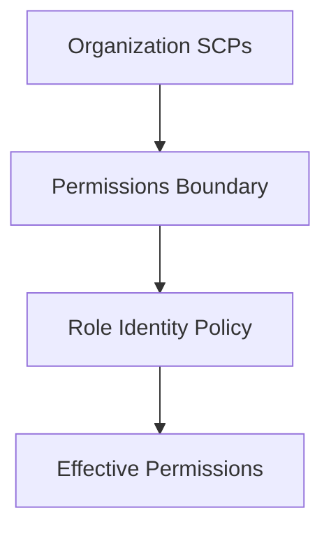

# Architecture of a IAM Role 

---
# AWS IAM Role — What, Why, When, How 

---

## 📖 Overview
An **IAM Role** is an AWS identity that defines **permissions** and is **assumable** by trusted principals (AWS services, users, applications, or external identities). Unlike users, roles **do not have long‑term credentials**; they provide **temporary credentials** via **STS** (Security Token Service) when assumed.

**Key takeaways:**
- Roles separate **who can assume** (trust policy) from **what they can do** (permission policies).  
- Roles enable **least privilege**, **automatic credential rotation**, **cross‑account access**, and **federation**.  
- For compute services (EC2/Lambda/ECS), roles are attached via **instance profiles** or service integrations, eliminating hard‑coded secrets.

---

## 🤔 What is in a Role?
An IAM Role typically includes:
1. **Trust Policy** — defines *who* (principal) can assume the role and *how* (e.g., `sts:AssumeRole`, `sts:AssumeRoleWithWebIdentity`).
2. **Identity (Permission) Policies** — define *what* actions are allowed (e.g., `s3:GetObject`) and on *which* resources.
3. (Optional) **Permissions Boundary** — an upper bound on the role's effective permissions.
4. (Optional) **Tags / Session Tags** — attributes passed in the STS session for ABAC and auditing.

---

## 💡 Why do we need IAM Roles?
- **No hard‑coded credentials:** Applications should avoid storing long‑term access keys; roles provide short‑lived credentials with automatic rotation.  
- **Least privilege & isolation:** Precisely scope what a workload can do; different workloads use different roles.  
- **Cross‑account access:** Grant access to resources in another account by allowing principals there to assume a role here.  
- **Federation (OIDC/SAML):** External identities (e.g., GitHub Actions via OIDC) can assume roles **without shared secrets**.  
- **Auditing & control:** STS sessions are logged; policies and boundaries enforce guardrails; tags enable attribute‑based access control.

---

## 🧩 Core Concepts (Fast Definitions)
- **Principal:** The entity allowed to assume the role (service `ec2.amazonaws.com`, account `arn:aws:iam::111122223333:root`, or web identity provider).  
- **Trust Policy:** JSON document attached to the role that lists principals and allowed STS actions.  
- **Permission Policy:** JSON policies attached to the role that grant actions on resources.  
- **Assume Role:** STS creates a temporary credential set (AccessKeyId/SecretAccessKey/SessionToken) with expiration.  
- **Instance Profile:** A wrapper that lets **EC2** attach a role to an instance.  
- **Role Chaining:** Assuming a role from an already assumed session; note **maximum 1 hour** session in chained scenarios.

---

## 🛠️ How to Create an IAM Role

### A) AWS Console (EC2 example)
1. Go to **IAM → Roles → Create role**.  
2. **Trusted entity type:** choose **AWS service**, select **EC2**.  
3. **Use case:** EC2.  
4. **Attach permissions:** e.g., `AmazonS3ReadOnlyAccess`.  
5. **Name** the role, create it.  
6. **Attach** to an EC2 instance via **Instance settings → Modify IAM role** or when launching.

---

### B) AWS CLI
Create role with trust policy:
```bash
cat > trust-policy.json <<'EOF'
{
  "Version": "2012-10-17",
  "Statement": [
    {
      "Effect": "Allow",
      "Principal": { "Service": "ec2.amazonaws.com" },
      "Action": "sts:AssumeRole"
    }
  ]
}
EOF

aws iam create-role   --role-name MyEC2Role   --assume-role-policy-document file://trust-policy.json
```

Attach permissions (managed policy):
```bash
aws iam attach-role-policy   --role-name MyEC2Role   --policy-arn arn:aws:iam::aws:policy/AmazonS3ReadOnlyAccess
```

Create instance profile and add role:
```bash
aws iam create-instance-profile --instance-profile-name MyEC2InstanceProfile
aws iam add-role-to-instance-profile   --instance-profile-name MyEC2InstanceProfile   --role-name MyEC2Role
```

---

### C) Terraform (minimal EC2 → S3 read example)
```hcl
resource "aws_iam_role" "ec2_role" {
  name = "my-ec2-role"

  assume_role_policy = jsonencode({
    Version = "2012-10-17",
    Statement = [{
      Effect = "Allow",
      Principal = { Service = "ec2.amazonaws.com" },
      Action   = "sts:AssumeRole"
    }]
  })
}

resource "aws_iam_role_policy" "s3_read_inline" {
  name = "s3-read-inline"
  role = aws_iam_role.ec2_role.id

  policy = jsonencode({
    Version = "2012-10-17",
    Statement = [{
      Effect   = "Allow",
      Action   = ["s3:GetObject", "s3:ListBucket"],
      Resource = [
        "arn:aws:s3:::my-bucket",
        "arn:aws:s3:::my-bucket/*"
      ]
    }]
  })
}

resource "aws_iam_instance_profile" "ec2_profile" {
  name = "my-ec2-instance-profile"
  role = aws_iam_role.ec2_role.name
}
```

> **Tip:** Prefer **managed policies** for reuse; use **inline policies** for role‑specific allowances.

---

## 📦 Example Scenario — EC2 → S3 (No Secrets)
**Problem:** An app on EC2 must read from a private S3 bucket.  
**Solution:** Attach an EC2 role with S3 read permissions via an instance profile. The app uses AWS SDK default credential provider chain to automatically pick up the **temporary credentials** exposed by the instance metadata service (IMDS).



---

## 🔐 Trust Policy vs Permission Policy
**Trust Policy** (who can assume):
```json
{
  "Version": "2012-10-17",
  "Statement": [
    {
      "Effect": "Allow",
      "Principal": { "Service": "ec2.amazonaws.com" },
      "Action": "sts:AssumeRole"
    }
  ]
}
```

**Permission Policy** (what the role can do):
```json
{
  "Version": "2012-10-17",
  "Statement": [
    {
      "Effect": "Allow",
      "Action": ["s3:ListBucket", "s3:GetObject"],
      "Resource": [
        "arn:aws:s3:::my-bucket",
        "arn:aws:s3:::my-bucket/*"
      ]
    }
  ]
}
```

---

## 🧭 Cross‑Account Access (Pattern)
Grant Account **A** permission to assume a role in Account **B**:

**In Account B (target role trust policy):**
```json
{
  "Version": "2012-10-17",
  "Statement": [
    {
      "Effect": "Allow",
      "Principal": { "AWS": "arn:aws:iam::111122223333:root" },
      "Action": "sts:AssumeRole",
      "Condition": {
        "StringEquals": { "sts:ExternalId": "my-external-id-123" }
      }
    }
  ]
}
```

**In Account A:** the principal must have an IAM policy allowing `sts:AssumeRole` on the role ARN in Account B.

---

## 🌐 OIDC Federation (GitHub Actions → AWS)
Use an **OIDC provider** so GitHub Actions can assume a role without storing AWS secrets.

**Role trust policy (snippet):**
```json
{
  "Version": "2012-10-17",
  "Statement": [
    {
      "Effect": "Allow",
      "Principal": { "Federated": "arn:aws:iam::123456789012:oidc-provider/token.actions.githubusercontent.com" },
      "Action": "sts:AssumeRoleWithWebIdentity",
      "Condition": {
        "StringEquals": {
          "token.actions.githubusercontent.com:sub": "repo:mohakhan03uk/terraform:ref:refs/heads/main"
        }
      }
    }
  ]
}
```

This lets workflows from the specified repository/branch obtain temporary credentials for deployments.

---

## 🧰 Advanced Topics & Best Practices
- **Least Privilege:** Scope actions and resources; avoid `Resource: "*"` where possible.  
- **Permissions Boundaries:** Use boundaries to cap max permissions for roles created by developers or automation.  
- **Session Duration:** Typical max is up to 12 hours for console‑initiated sessions; **role chaining** enforces **1 hour** max.  
- **Session Tags:** Pass attributes (like `Project=Alpha`) when assuming roles for ABAC.  
- **Conditions:** Use policy conditions (e.g., `aws:SourceVpce`, `s3:prefix`) to tighten access.  
- **SCPs vs Boundaries vs Identity Policies:**  
  - **SCPs (Org level)**: global guardrails; can *deny* even if a role allows.  
  - **Boundary (IAM level)**: upper cap per role or user.  
  - **Identity policy**: grants within the caps and guardrails.  
- **Rotating trust:** Prefer service principals and OIDC where possible; avoid cross‑account static access keys.  
- **Logging & Monitoring:** Use CloudTrail, IAM Access Analyzer, and AWS Config rules to detect overly broad roles.

---

## 🧪 Quick Test (AWS CLI)
Assume a role and list S3 buckets:
```bash
aws sts assume-role   --role-arn arn:aws:iam::123456789012:role/my-demo-role   --role-session-name demo-session > /tmp/creds.json

export AWS_ACCESS_KEY_ID=$(jq -r .Credentials.AccessKeyId /tmp/creds.json)
export AWS_SECRET_ACCESS_KEY=$(jq -r .Credentials.SecretAccessKey /tmp/creds.json)
export AWS_SESSION_TOKEN=$(jq -r .Credentials.SessionToken /tmp/creds.json)

aws s3 ls
```

---

## 🧾 Common Gotchas
- **Missing instance profile for EC2:** Creating a role isn’t enough; attach via an **instance profile**.  
- **Trust misconfiguration:** If a principal isn’t listed (or action isn’t correct), `AccessDenied` on `AssumeRole`.  
- **Wildcard resources:** May unintentionally grant access beyond expectations—tighten ARNs.  
- **SCP denies:** Even with correct role policies, org SCPs can block actions.  
- **IMDSv2 requirement:** Enforce IMDSv2 for EC2 to reduce metadata tampering risk.

---

## ✅ Summary Table
| Topic | Short Explanation |
|---|---|
| Role purpose | Temporary credentials and least‑privilege access |
| Trust policy | Defines who can assume the role |
| Permission policy | Defines what actions resources are allowed |
| Instance profile | Mechanism to attach a role to EC2 |
| Cross‑account | Enable access across AWS accounts via STS |
| Federation | OIDC/SAML sign‑in without storing secrets |

---

## 🖼️ Visuals (Mermaid)

### EC2 → Role → S3 (flow)


### Policy layering


---

## 📚 References
- AWS IAM roles docs (concepts, policies, and use cases) — https://docs.aws.amazon.com/IAM/latest/UserGuide/id_roles.html  
- AWS STS AssumeRole — https://docs.aws.amazon.com/STS/latest/APIReference/API_AssumeRole.html  
- IAM policies and condition keys — https://docs.aws.amazon.com/IAM/latest/UserGuide/access_policies.html  
- Instance profiles for EC2 — https://docs.aws.amazon.com/IAM/latest/UserGuide/id_roles_use_switch-role-ec2.html  
- OIDC for GitHub Actions to assume roles — https://docs.github.com/actions/deployment/security-hardening-your-deployments/about-security-hardening-with-openid-connect  

---

###
**© MohammadImran Khan**
