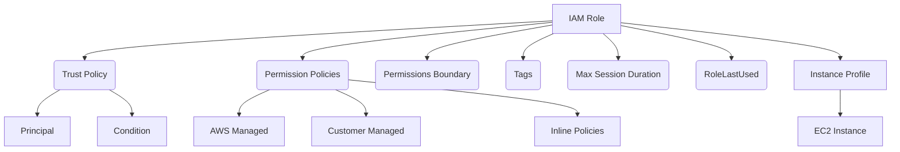

# AWS IAM Role — Complete Structure, Fields & Explanation 
---

# 📘 Overview
This document provides the **complete structure of an AWS IAM Role**, along with detailed explanations of every field, trust policy, permission policy attachments, role metadata, and instance profile.

---

# 🧱 1. Full IAM Role Structure (AWS API Model)
Below is the full structure returned by AWS when you run:
```
aws iam get-role --role-name MyRole
```

```json
{
  "Role": {
    "Path": "/",
    "RoleName": "MyRole",
    "RoleId": "AROA1234567890EXAMPLE",
    "Arn": "arn:aws:iam::111122223333:role/MyRole",
    "CreateDate": "2025-01-01T12:00:00Z",
    "AssumeRolePolicyDocument": {
      "Version": "2012-10-17",
      "Statement": [
        {
          "Effect": "Allow",
          "Principal": { "Service": "ec2.amazonaws.com" },
          "Action": "sts:AssumeRole",
          "Condition": {
            "StringEquals": {
              "sts:ExternalId": "12345"
            }
          }
        }
      ]
    },
    "Description": "A role used for EC2 to access S3",
    "MaxSessionDuration": 3600,
    "PermissionsBoundary": {
      "PermissionsBoundaryType": "Policy",
      "PermissionsBoundaryArn": "arn:aws:iam::111122223333:policy/BoundaryPolicy"
    },
    "Tags": [
      { "Key": "Environment", "Value": "Prod" },
      { "Key": "Team", "Value": "DevOps" }
    ],
    "RoleLastUsed": {
      "LastUsedDate": "2025-01-05T10:30:00Z",
      "Region": "eu-west-1"
    }
  }
}
```

---

# 🧩 2. Explanation of Every Field

## 🔹 Path
Used to group and organize IAM roles.
Example:
```
"/application/team1/"
```

## 🔹 RoleName
Human‑readable name for the role.

## 🔹 RoleId
Globally unique immutable identifier.

## 🔹 Arn
Amazon Resource Name used to reference this role.

## 🔹 CreateDate
Timestamp when the role was created.

---

# 🧩 3. Trust Policy (AssumeRolePolicyDocument)
Defines **who can assume the role**.

### Structure:
```json
{
  "Version": "2012-10-17",
  "Statement": [
    {
      "Sid": "OptionalID",
      "Effect": "Allow",
      "Principal": {
        "Service": "ec2.amazonaws.com"
      },
      "Action": "sts:AssumeRole",
      "Condition": {
        "StringEquals": {
          "sts:ExternalId": "12345"
        }
      }
    }
  ]
}
```

### Explanation of trust policy fields:
| Field | Purpose |
|-------|---------|
| Version | Policy syntax version |
| Statement | Policy rules |
| Action | Usually `sts:AssumeRole` |
| Principal | Who is allowed to assume the role |
| Condition | Optional restrictions (MFA, account, OIDC, IP, VPCE, etc.) |

---

# 🧩 4. Permissions Policies (Identity Policies)
These are **not inside the role**. They are attached **to** the role.

### Types:
- AWS managed policies
- Customer managed policies
- Inline policies

### Example (inline policy attached to role):
```json
{
  "Version": "2012-10-17",
  "Statement": [
    {
      "Effect": "Allow",
      "Action": ["s3:ListBucket", "s3:GetObject"],
      "Resource": [
        "arn:aws:s3:::my-bucket",
        "arn:aws:s3:::my-bucket/*"
      ]
    }
  ]
}
```

---

# 🧩 5. Permissions Boundary
Optional. Limits the **maximum** permissions the role can have.

Example:
```json
{
  "PermissionsBoundaryArn": "arn:aws:iam::111122223333:policy/SecurityBoundary"
}
```

---

# 🧩 6. MaxSessionDuration
Defines how long temporary credentials can last.
- Default: **1 hour**
- Maximum: **12 hours**

Example:
```
"MaxSessionDuration": 43200
```

---

# 🧩 7. Tags
Used for ABAC, cost allocation, categorization.
```json
[
  { "Key": "Team", "Value": "DevOps" },
  { "Key": "Environment", "Value": "Production" }
]
```

---

# 🧩 8. RoleLastUsed
Tracks when and where the role was last used.
```json
{
  "LastUsedDate": "2025-01-05T10:30:00Z",
  "Region": "eu-west-1"
}
```

---

# 🧱 9. Instance Profile (Required for EC2)
EC2 **cannot** use roles directly.
It must use an **instance profile**, which contains one role.

### Structure:
```json
{
  "InstanceProfileName": "MyInstanceProfile",
  "InstanceProfileId": "AIPAABCDEFG1234",
  "Arn": "arn:aws:iam::111122223333:instance-profile/MyInstanceProfile",
  "Roles": [
    {
      "Arn": "arn:aws:iam::111122223333:role/MyRole"
    }
  ]
}
```

---

# 🧭 10. IAM Role Architecture Diagram


---

# 🧾 Summary of IAM Role Structure
| Component | Description |
|----------|-------------|
| Role metadata | Name, ID, ARN, timestamps |
| Trust policy | Defines WHO can assume the role |
| Permissions policies | Defines WHAT the role can do |
| Permissions boundary | Maximum allowed permissions |
| Tags | Useful for ABAC and cost allocation |
| MaxSessionDuration | 1 to 12 hours |
| RoleLastUsed | When the role was last invoked |
| InstanceProfile | Required ONLY for EC2 |

---

# 📌 Footer
**© MohammadImran Khan** — IAM Role Full Structure Documentation
