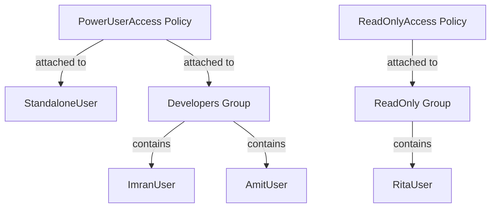
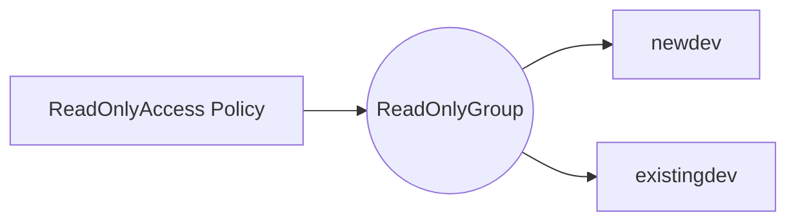

# IAM USER
```
resource "aws_iam_user" "iamuser_john" {
  name = "iamuser_john"
}
```

```
C:\Users\mohakhan\Downloads\terraform_1.11.4_windows_386\iam_user>..\terraform.exe apply -auto-approve

Terraform used the selected providers to generate the following execution plan. Resource actions are indicated with the following symbols:
  + create

Terraform will perform the following actions:

  # aws_iam_user.iamuser_john will be created
  + resource "aws_iam_user" "iamuser_john" {
      + arn           = (known after apply)
      + force_destroy = false
      + id            = (known after apply)
      + name          = "iamuser_john"
      + path          = "/"
      + tags_all      = (known after apply)
      + unique_id     = (known after apply)
    }

Plan: 1 to add, 0 to change, 0 to destroy.
aws_iam_user.iamuser_john: Creating...
aws_iam_user.iamuser_john: Creation complete after 1s [id=iamuser_john]

Apply complete! Resources: 1 added, 0 changed, 0 destroyed.

```


# IAM GROUP 
```
resource "aws_iam_group" "iamgroup_siva" {
  name = "iamgroup_siva"
}
```

```
C:\Users\mohakhan\Downloads\terraform_1.11.4_windows_386\iam_groups>..\terraform.exe apply -auto-approve

Terraform used the selected providers to generate the following execution plan. Resource actions are indicated with the following symbols:
  + create

Terraform will perform the following actions:

  # aws_iam_group.iamgroup_siva will be created
  + resource "aws_iam_group" "iamgroup_siva" {
      + arn       = (known after apply)
      + id        = (known after apply)
      + name      = "iamgroup_siva"
      + path      = "/"
      + unique_id = (known after apply)
    }

Plan: 1 to add, 0 to change, 0 to destroy.
aws_iam_group.iamgroup_siva: Creating...
aws_iam_group.iamgroup_siva: Creation complete after 1s [id=iamgroup_siva]

Apply complete! Resources: 1 added, 0 changed, 0 destroyed.
```
# 🧾 IAM Architecture Diagram

This section explains **how IAM Users, Groups, Policies, and Roles** fit together in a real AWS account.
---

## 1️⃣ IAM Users + Groups + Policies Architecture
> Policy is the source of permissions, and the group/user/role consumes it.


---

# AWS IAM User – (What, Why, How, Permissions, Examples)

## What is an IAM User?

An **IAM User** is an **identity in AWS** that represents a **human or an application** that needs **long-term credentials** which needs to interact with AWS resources.

An IAM User consists of:
- A **name**
- **Credentials** (*password* for AWS Console and/or *access keys* for AWS CLI / SDK)
- **Permissions** (defined using IAM policies) 

👉 IAM Users live inside an **AWS Account**.

---

## Why Do We Need IAM Users?
- To give **individual login access** to the AWS console
- To let applications use **access keys** (only when roles can't be used)

### 1. Root User Is Dangerous 🚨
When you create an AWS account, you get a **root user**.
- Root user has **full, unrestricted access**
- Best practice: **DO NOT use root for daily work**

IAM Users solve this problem by:
- Allowing **least privilege access**
- Enabling **individual identities**
- Supporting **auditing and tracking** via  (CloudTrail auditing)

---

### 2. Security & Access Control
IAM Users allow:
- Different users with different permissions
- Credential rotation
- MFA (Multi-Factor Authentication)
- Activity tracking via CloudTrail

---

### 3. Application & Automation Access
Applications and automation tools (Terraform, Ansible, CI/CD pipelines) **cannot log in as root**.
They use IAM Users (or IAM Roles) with access keys.

---

## When Should You Use an IAM User?

| Scenario | IAM User Needed? |
|--------|------------------|
Developer accessing AWS Console | ✅ Yes |
Terraform / AWS CLI automation | ✅ Yes |
CI/CD pipeline (GitHub Actions, Jenkins) | ✅ Yes |
Temporary access for EC2/Lambda | ❌ No (Use IAM Role) |
Cross-account access | ❌ Prefer IAM Role |
> 👉 Best Practice:\
> Humans → IAM Users\
> AWS Services / EC2 / Lambda → IAM Roles

---

## How to Create an IAM User

### Method 1: AWS Management Console

1. Go to **IAM → Users**
2. Click **Create user**
3. Enter:
   - User name (example: `devops-user`)
4. Select access type:
   - ✅ AWS Management Console access
   - ✅ Access key – Programmatic access
5. Attach permissions:
   - Attach existing policies (or create custom)
6. (Optional) Enable MFA
7. Create user

---

### Method 2: AWS CLI

```bash
Create User : aws iam create-user --user-name devops-user
Create access keys:  aws iam create-access-key --user-name devops-user
Attach a policy:     aws iam attach-user-policy --user-name devops-user --policy-arn arn:aws:iam::aws:policy/AmazonEC2ReadOnlyAccess
```
### Method 2: Terraform
```
resource "aws_iam_user" "devops" {
  name = "devops-user"
}

resource "aws_iam_user_policy_attachment" "ec2_readonly" {
  user       = aws_iam_user.devops.name
  policy_arn = "arn:aws:iam::aws:policy/AmazonEC2ReadOnlyAccess"
}
```
---
## Types of IAM Permissions
Permissions are defined using IAM Policies (JSON documents).
### 1. AWS Managed Policies
Created and maintained by AWS\
Example:\
AmazonEC2ReadOnlyAccess\
AdministratorAccess\
✅ Easy\
❌ Too broad sometimes

###  2. Customer Managed Policies
Created and maintained by you, \
Reusable across users, groups, roles\
Example:
```json
{
  "Version": "2012-10-17",
  "Statement": [
    {
      "Effect": "Allow",
      "Action": "ec2:DescribeInstances",
      "Resource": "*"
    }
  ]
}
```

### 3. Inline Policies
Attached directly to a single IAM user\
Not reusable\
⚠️ Not recommended for large setups
---


# 📚 Example Scenario
## "New Developer joins the team"
**Requirement:** Developer must have read‑only access to production AWS.

### Solution:
1. Create user → `newdev`
2. Add to `ReadOnlyGroup`
3. Attach `ReadOnlyAccess` policy to group

Diagram:


---

---
# 👥 IAM Group

## ✅ What is an IAM Group?
A **Group** is a **collection of IAM users**. Groups cannot have access keys or passwords; they only serve to organize permissions.

---

## 🧐 Why do we need IAM Groups?
- To **assign policies to many users at once**
- To follow security best practices: *manage permissions at group level, not user level*
- To simplify team onboarding/offboarding
- To make permission management scalable

---

## 🔐 Permissions for IAM Groups
You can attach policies such as:
- `ReadOnlyAccess`
- `PowerUserAccess`
- `AdministratorAccess`
- Custom policies

All users in the group inherit these permissions.

---

## 🛠️ How to create an IAM Group

### A) AWS Console
1. Go to **IAM → Groups → Create Group**
2. Name the group (e.g., *Developers*)
3. Attach policies
4. Add users to the group

---

### B) AWS CLI
Create group:
```bash
aws iam create-group --group-name Developers
```

Attach policy:
```bash
aws iam attach-group-policy   --group-name Developers   --policy-arn arn:aws:iam::aws:policy/PowerUserAccess
```

Add user to group:
```bash
aws iam add-user-to-group   --user-name ImranUser   --group-name Developers
```

---

### C) Terraform
```hcl
resource "aws_iam_group" "developers" {
  name = "Developers"
}

resource "aws_iam_group_policy_attachment" "dev_policy" {
  group      = aws_iam_group.developers.name
  policy_arn = "arn:aws:iam::aws:policy/PowerUserAccess"
}

resource "aws_iam_user_group_membership" "users_in_group" {
  user = aws_iam_user.example_user.name
  groups = [aws_iam_group.developers.name]
}
```

---

# 📎 References
- AWS IAM Users → https://docs.aws.amazon.com/IAM/latest/UserGuide/id_users.html
- AWS IAM Groups → https://docs.aws.amazon.com/IAM/latest/UserGuide/id_groups.html
- IAM Best Practices → https://docs.aws.amazon.com/IAM/latest/UserGuide/best-practices.html

---

# 📌 Footer
**© MohammadImran Khan**
